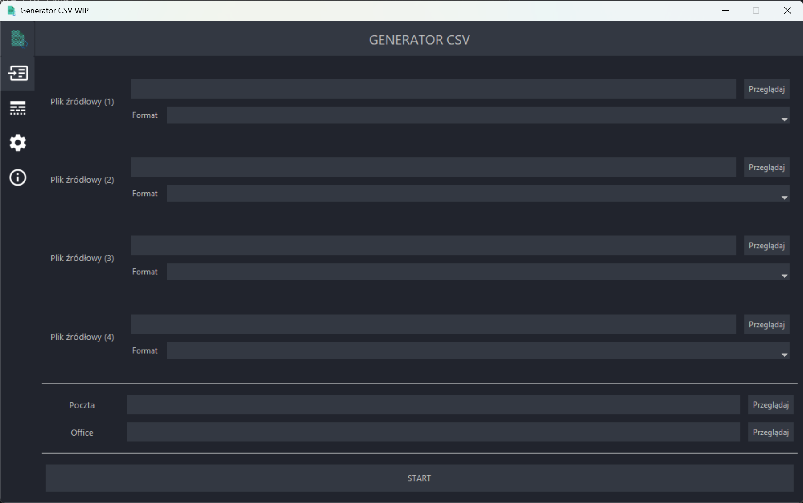

<p align="center"></p>

<h1 align="center">Generator CSV</h1>

<h3 align="center"><b>Konwerter struktury plików z danymi uczniów i nauczycieli dla Microsoft 365 Admin Center.</b></h3>

<p align="center">Generator CSV został napisany z użyciem języka Python oraz biblioteki Tkinter. Projekt został zaimplementowany w celu wprowadzenia w mojej szkole (ZSP Sobolew) usługi Microsoft 365.</p>

<p align="center"></p>

---

## Informacje

> [!IMPORTANT]  
> Apikacja nie jest już utrzymywana, jednak powinna nadal działać.

## Możliwości

- Konwertowanie danych uczniów i nauczycieli z jednego formatu (np. formatu danych dziennika elektronicznego) do innego (formatu danych wymaganego przez Microsoft 365 Admin Center)
- Presety formatu plików 
- Duże możliwości dostosowywania generowania plików
- Możliwość zmiany wyglądu interfejsu

## Instalacja

Pobierz ostatnią wersję aplikacji z zakładki <a href="https://repos.mateuszskoczek.com/MateuszSkoczek/GeneratorCSV/releases">Releases</a>, rozpakuj, zainstaluj wymagane programy i biblioteki, i gotowe.

**Wymagania**

- Zainstalowany interpreter Pythona
- Biblioteki PIP:
    - `pillow==9.0.1`
    - `tk`

Biblioteki PIP mogą zostać zainstalowane z użyciem pliku `requirements.txt`.

```
pip install -r requirements.txt
```

## Użycie

```
python generator_csv
```

Dokładna dokumentacja znajduje się w Wiki

## Attribution

Możesz dowolnie kopiować to repozytorium i tworzyć nowe wersje programu. Jednakże byłoby miło, gdybyś zawarł informacje o tym repozytorium w opisie swojego repozytorium lub w pliku README.

**Inne źródła:**

- Ikona dzięki uprzejmości <a href="icons8.com">Icons8</a>